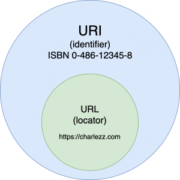

[TOC]


# Web Service

- Web: 월드와이드웹(WWW). 인터넷에 연결된 컴퓨터들을 통해 사람들이 정보를 공유할 수 있는 정보 공간.

- 고객(사용자)의 요청에 대한 응답을 주는 것.(from server, computer)


#### 웹 서비스의 과정


- 사용자는 웹 브라우저를 통해 원하는 페이지에 접속.
- 웹 브라우저는 URI에 입력된 주소가 가리키는 DNS에 요청을 보내고, DNS는 도메인을 IP로 변경하여 응답함.
- 웹 브라우저는 다시 응답받은 해당 ip로 요청을 보내고, 서버는 서버 내부 통신 과정을 거쳐 사용자에게 데이터를 응답함.


#### 정적 페이지 vs 동적 페이지


- 정적인 페이지(html, css, js)은 모든 사용자에게 같은 데이터를 보여주기 때문에 웹 서버에 컨텐츠를 가지고 있다가 사용자에게 바로 보여주면 된다.
- 동적인 페이지는 사용자마다 다른 페이지를 보여줘야 하기 때문에 요청 메소드에 따라, 사용자에 따라 다른 데이터를 보내줘야 하므로 웹 컨테이너와의 통신이 필요하다.
- 웹 컨테이너에서는 URL과 특정 서블릿[^1]을 맵핑해 요청에 맞는 로직을 수행하고(필요하다면 DB와의 통신을 포함) 정적인 파일로 만들어 웹 서버로 다시 전송해 주고, 웹 서버는 이를 클라이언트에게 전송한다.


#### 서블릿

- 웹페이지를 동적으로 생성하는 Java 프로그램 사양
- 자바를 사용하여 웹페이지를 동적으로 생성하는 서버측 프로그램


1. 사용자(클라이언트)가 URL을 입력하면 HTTP Request가 Servlet Container로 전송합니다.
2. 요청을 전송받은 Servlet Container는 HttpServletRequest, HttpServletResponse 객체를 생성합니다.
3. web.xml을 기반으로 사용자가 요청한 URL이 어느 서블릿에 대한 요청인지 찾습니다.
4. 해당 서블릿에서 service메소드를 호출한 후 클리아언트의 GET, POST여부에 따라 doGet() 또는 doPost()를 호출합니다.
5. doGet() or doPost() 메소드는 동적 페이지를 생성한 후 HttpServletResponse객체에 응답을 보냅니다.
6. 응답이 끝나면 HttpServletRequest, HttpServletResponse 두 객체를 소멸시킵니다.


#### WAS vs Web server

- WAS는 웹서버와 웹 컨테이너를 붙여 놓은 것이다. WAS = Web Server + Web Container
- WAS가 필요한 이유는 동적인 응답을 필요로 할 때 모든 페이지를 저장해두고 쓸 수 없기 때문.(정적인 응답은 여전히 Web server를 통해 응답하도록 하여 자원을 절약)


### 요청의 종류

1. 줘라(Get) : url에 직접 요청을 입력하는 방식 (길이제한 존재)
2. 받아라(Post) : 숨겨져서(body안에) 보내진다. (form을 이용해 submit)


- IP (Internet Protocol) : 8비트의 숫자로 구성된 숫자의 집합으로, 각자가 가지고 있는 주소와 동일하다.

  ex) 172.217.27.78

  

- 도메인(Domain Name Service) : 네트워크상의 컴퓨터를 식별하는 호스트명(사람에게 읽기 쉽게 이름 부여)

  ex) google.com

  

- URL(Uniform Resource Locator) : 도메인 + 경로

  ex) https://www.google.co.kr/search?q=구글


### static web

정적 웹. 어떤 요청이 오든 정해진 하나의 응답밖에 못함. 접속 시마다 같은 응답을 함. 

ex) 학교 홈페이지, 댓글 기능이 없는 블로그


### Dynamic web

동적 웹.  플라스크처럼 우리가 요청하는 것을 변환해서 응답해줌.

ex) 댓글, 게시물 작성이 가능한 홈페이지


### HTML(Hyper Text Markup Language)

- 기존의 텍스트 : 페이지의 순서에 따라 글을 읽음. (선형적)

- 하이퍼 텍스트 : 순서와 상관없이 링크를 통해 문서를 넘나들며 읽어 나감. (비선형적)


### HTTP(Hyper Text Transfer Protocol)

하이퍼텍스트를 주고받는 통신규약


### HTTP와 HTTPS의 차이점

HTTP 통신에 있어 암호화를 하는지 안하는지의 차이.

예를 들어 사용자가 로그인을 할 때 일반 HTTP 통신에서는 Password가 그대로 노출될 우려가 있지만, HTTPS에서는 SSL(보안 소켓 계층) 인증서 등을 통해 이를 암호화해서 통신함.


### CSS(Cascading Style Sheet)

HTML 상태의 문서를 보기에 좋게, 이쁘게 가시화시켜줌.


- 요소 (Element)

HTML의 요소는 태그와 내용으로 구성되어 있다.

태그는 대소문자를 구별하지 않으나, 소문자로 작성해야 한다.

요소간 중첩도 가능하다.


- 속성(attribute)

태그에는 속성이 지정될 수 있다.


a 태그

```html
<a href="https://developer.mozilla.org/ko/" target="_blank">모질라 재단</a>

href="#" 을 할시 하이퍼링크는 활성화시키면서 실제로는 이동하지 않는다.
a 태그 안에 image 태그를 포함시켜 응용 가능.
target 속성에 blank를 추가하면 새 창에 띄울 수 있다.
```


미디어 태그

``` html
이미지


추가 속성
tableindex :
alt : 이미지가 로드되지 않을 때 띄울 화면
width
height

<video src="/video.mp4"/>
<iframe src="https://www.w3schools.com"></iframe>
width
height
```


시맨틱 태그

컨텐츠의 의미를 설명하는 태그로서, HTML5에 새롭게 추가된 시맨틱 태그가 있다.(추가필요)


- element:nth-child() : 해당하는 태그의 순서 기준으로 해당
- element:nth-of-type() : 부모 속성 밑에서 특정 태그를 가진 자식 속성만 해당
- 둘이 겹칠시 nth of type이 우선시됨.


```html
<div>
   <p>test line 1</p>
   <span>test line 2</span>
   <p>test line 3</p>
   <p>test line 4</p>
   <span>test line 5</span>
</div>

<style>
   p:nth-of-type(2) { color: red; } # p태그 가진 것들중 2번째가 빨간색으로 변경 line3
   p:nth-child(2) { color: blue; } # line2가 변경 
   p:nth-child(4) { color: green; }
   span:nth-child(1) { color: orange; }
   span:nth-of-type(1) { color: yellow; }
</style>
```


# REST API

REST는 네트워크 **아키텍처 원리의 모음**인데, 여기서의 원리란 네트워크에서 자원을 정의하고 자원에 대한 주소를 지정하는 방법 전반을 말한다.


RESTful 개발을 위한 원칙은 다음과 같이 요약할 수 있다.


**URI는 정보의 자원을 표현해야 한다.** 

REST에서는 자원을 지칭하는 메세지와 데이터만 있다면 서버 상의 자원을 변경하고 삭제할 수 있는 모든 정보가 있는 것으로 판단한다.

예를 들면 사용자 정보를 삭제하는 메소드에 대해서 `GET /members/delete/1` 으로 표현하는 것이 아니라, `    DELETE /members/1`로 표현하는 것이다. 정보의 자원인 members를 URI에서 표현하고 있고, 그 행위에 대한 정의는 메소드를 통해 하고 있다.


REST API의 통신은 가볍게 기계와 인간 모두가 이해하기 쉬운 데이터 형식인 JSON으로 하는 것이 일반적이다.


REST의 목표는 결국 웹 통신에 있어서 불필요한 자원의 낭비를 줄이고, API 이용 속도의 향상과 경량화이다.


추가필요 : REST API 디자인 규약

https://swalloow.github.io/open-api-guide/


참고 :  https://meetup.toast.com/posts/92

위키백과 : https://ko.wikipedia.org/wiki/REST


# URI / URL




- URL(Uniform Resource Locator)은 자원이 실제로 존재하는 위치를 가리킴
- URI(Uniform Resource Identifier:통합 자원 식별자)는 자원의 위치뿐 아니라 자원에 대한 고유 식별자로서 사용되는 의미를 포함
- 따라서 URI는 URL을 포괄한다고 볼 수 있다.


```
http://www.naver.com/user/1
```

- 위 URI에서, www.naver.com까지는 자원의 실제 위치를 나타내고 있으므로 URI임과 동시에 URL라고 볼 수 있다.
- 나머지 부분인 id값 1을 포함하게 되면 자원에 대한 논리적 식별자를 포함하게 되므로 URI라고 지칭해야 한다.


# 쿠키와 Samesite

https://seob.dev/posts/%EB%B8%8C%EB%9D%BC%EC%9A%B0%EC%A0%80-%EC%BF%A0%ED%82%A4%EC%99%80-SameSite-%EC%86%8D%EC%84%B1/


------------------------------------------------

[^1]: 클라이언트의 요청을 처리하고, 그 결과를 반환하는  Servlet 클래스의 구현 규칙을 지킨 자바 웹 프로그래밍 기술. 자바를 사용하여 웹을 만들기 위해 필요한 기술.

