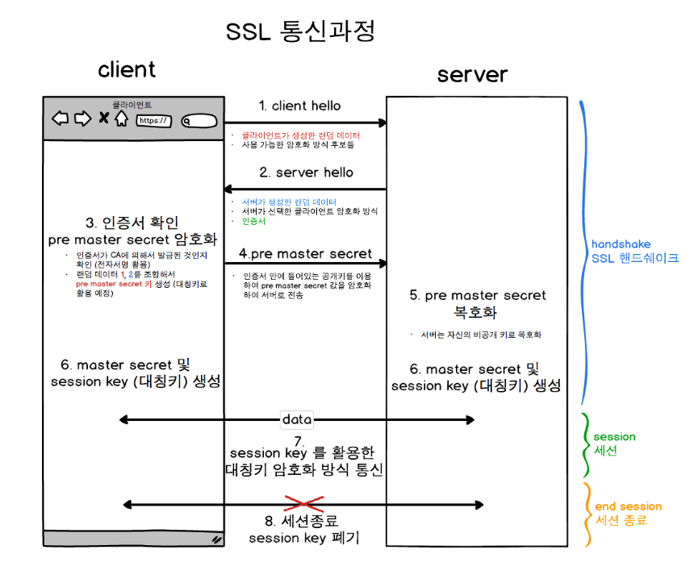

# HTTPS와 SSL

## HTTP

- HTTP는 Hypertext Transfer Protocol의 약자다. 즉 Hypertext인 HTML을 전송하기 위한 통신규약을 의미한다.
- 클라이언트와 서버 사이에 이루어지는 요청/응답 프로토콜
- 암호화되지 않은 방법으로 데이터를 전송하므로 감청, 변조의 위험이 있다.

## HTTPS

- Hypertext Transfer Protocol Over Secure Socket Layer의 약자
- 모든 HTTP 요청과 응답 데이터는 네트워크로 보내지기 전에 암호화된다.
- HTTP는 HTTP의 하부에 SSL과 같은 보안계층을 제공함으로써 동작한다.

## SSL (Secure Socket Layer)

- 보안계층

- 일반적으로 SSL이라고하면 SSL 디지털 인증서를 말하는데, 이 디지털 인증서를 통해 HTTP를 암호화하여 HTTPS 통신을 구현한다.

- 대칭키 암호화 기법과 공개키 암호화 기법이 있다.

  

