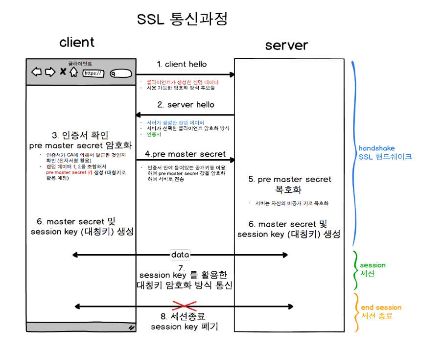

# Network

https://www.clien.net/service/board/lecture/15872844 네트워크에 대한 기본


## 사설 IP 대역과 공인 IP 대역


### 공인

0.0.0.0~127.255.255.255
128.0.0.0~191.255.255.255
192.0.0.0~233.255.255.255
224.0.0.0~239.255.255.255
240.0.0.0~255.255.255.255


### 사설

10.0.0.0~10.255.255.255
172.16.0.0~172.31.255.255
192.168.0.0~192.168.255.255


### CIDR


- 본문에서 1의 갯수는 28개가 아니라 26개네요^^

  본문에 나온 /26으로 부연 설명을 해 보면
  IP 주소 32 비트 중에서 네트워크 주소 비트수가 26이니까 호스트 주소의 비트수는
  32-26 = 6비트이고,
  6비트로 표현할 수 있는 가짓수 2^=64개 (0~63)의 주소를 쓸 수 있죠.
  이 0~63번의 주소는 아래와 같이 사용됩니다.

  /26으로 표시되는 각 네트워크들의 주소는
  xxx.yyy.zzz.0, 64, 128, 192 + '0' (64씩 증가)이고,
  각 네트워크 안에 있는 호스트에는
  네트워크주소+('1 ~ 62')의 주소를 줄 수 있고
  마지막 64번째 주소인 네트워크주소 + '63'은
  그 네트워크의 브로드캐스트 주소로 사용합니다.

  그리고
  1이 0개면 00000000 = 0
  1이 1개면 10000000 = 128
  1이 2개면 11000000 = 128 + 64 =192
  1이 3개면 11100000 = 192 + 32 = 224
  1이 4개면 11110000 = 224 + 16 = 240
  1이 5개면 11111000 = 240 + 8 = 248
  1이 6개면 11111100 = 248 + 4 = 252
  1이 7개면 11111110 = 252 + 2 = 254
  1이 8개면 11111111 = 254 + 1 = 255

  요 계산만 이해하시면 네트워크 다룰 때 2진수 계산이 필요 없어집니다..

  예를 들어서 어느 주소가 어느 네트워크에 속하는지 계산을 해야할 경우가 있는데,
  주소가 123.123.123.123이고 서브넷마스크가 255.255.255.224라고 하면
  네트워크 주소 비트는 8+8+8+3=27이고
  호스트 주소 비트는 32-27=5가 되죠.
  그러면 /27인 네트워크는 2^5=32개의 주소를 가질 수 있으니까
  123.123.123.123은 123.123.123.96~123.123.123.127 사이에 있는 주소라는 걸 알 수 있습니다.
  즉 123.123.123.96/27 네트워크에 있는 셈입니다.
  그리고 그 네트워크에서 호스트가 사용할 수 있는 주소는 123.123.123.97~126이 됩니다.


10.0.30.0/23이라면 2의 배수만 ip로 사용할 수 있다.

23이라면 3번째 옥텟의 00000000중에 0000000만 사용할 수 있는데, 128 64 32 16 8 4 2 1


사이더 계산법 : https://kim-dragon.tistory.com/9

https://kim-dragon.tistory.com/154

참고: https://bumday.tistory.com/19

계산기 : https://www.ipaddressguide.com/cidr


## 실습

- LAMP= Linux + Apache + Mysql(MariaDB) + PHP, Pearl, Python
- Access Control Group
- *IAM*(Identity Access Management)


bastion, mysql


NACL 검색해보기

192.168 - 사설ip대역


- **같은 VPC 내의 통신은 비공인 IP를 사용하고, 외부에서 들어오는 통신에 대해서는 공인 IP를 사용한다.**


## NACL과 ACG

VPC(NCP에서 가장 큰 망 단위) - NACL(서브넷에 대응) - ACG(서버에 대응)

- **NACL - 무조건 IN OUT 룰 이 다 있어야함(없으면 모든 ip에 대해 허용) (Default : Allow)**

- **ACG - 들어오는 룰에 대한 아웃바운드룰이 없으면 모두 deny됨( Default : deny)**

- **NCP에서는 NACL은 허용 및 거부 여부를 선택할 수 있고, ACG는 허용할 포트를 입력할 수 있다** 


## stateless / stateful

- 쉽게 이해하면 stateless는 MSA, stateful은 전통적인 수직형 서버 구조


- private 서버 포트란 무엇인가?


### ssh 접속 명령어

```
ssh root@135.79.246.80
```


## SSH

Secure Sell의 약자로 원격지에 있는 컴퓨터를 안전하게 제어하기 위한 프로토콜 또는 이 프로토콜을 사용하는 프로그램들을 의미한다. SSH 클라이언트와 SSH 서버의 관계로 상호작용하면서 SSH 서버가 설치된 운영체제를 제어한다. 클라이언트와 서버 사이에는 강력한 암호화 방법을 통해서 연결되어 있기 때문에 데이터를 중간에서 가로채도 해석 할 수 없는 암호화된 문자만이 노출된다. 지금까지는 Telnet을 주로 사용했는데 이것을 대체하기 위한 통신 방법이다. 


## SSH 클라이언트

리눅스와 Mac과 같은 Unix 계열의 운영체제는 기본적으로 SSH 클라이언트가 설치 되어 있기 때문에 SSH를 이용하기 위해서 특별한 클라이언트가 필요하지 않다. 하지만 SSH 는 윈도우 운영체제에는 SSH 클라이언트가 설치되어 있지 않다. SSH 클라이언트를 설치해야 윈도우에서 Unix 계열의 운영체제를 제어 할 수 있다. 대표적인 SSH 클라이언트는 아래와 같은 것들이 있다. 

- PuTTY
- Xshell


## SSH 서버

SSH는 Unix 계열의 운영체제를 원격에서 제어하기 위한 방법이다. 그렇기 때문에 원격지에 있는 윈도우 운영체제를 SSH로 제어 하는 것은 일반적이지 않다. 윈도우에는 클라이언트 운영체제로 사용할 수 있을 뿐이다. 유닉스 계열의 운영체제에서는 OpenSSH가 가장 많이 사용된다. OpenSSH는 SSH 클라이언트와 서버를 포함한다. Mac은 SSH 클라이언트와 서버가  이미 설치 되어 있기 때문에 SSH를 이용하기 위해서 특별한 조치는 필요하지 않다.


## HTTPS와 SSL

### HTTP

- HTTP는 Hypertext Transfer Protocol의 약자다. 즉 Hypertext인 HTML을 전송하기 위한 통신규약을 의미한다.
- 클라이언트와 서버 사이에 이루어지는 요청/응답 프로토콜
- 암호화되지 않은 방법으로 데이터를 전송하므로 감청, 변조의 위험이 있다.


### HTTPS

- Hypertext Transfer Protocol Over Secure Socket Layer의 약자
- 모든 HTTP 요청과 응답 데이터는 네트워크로 보내지기 전에 암호화된다.
- HTTP는 HTTP의 하부에 SSL과 같은 보안계층을 제공함으로써 동작한다.

kigepe-mal-pub-alb-01-999024-dfd1a6d27c79.kr-gov.lb.naverncp.com

223.130.169.85

### SSL (Secure Socket Layer)

- 보안계층

- 일반적으로 SSL이라고하면 SSL 디지털 인증서를 말하는데, 이 디지털 인증서를 통해 HTTP를 암호화하여 HTTPS 통신을 구현한다.

- 대칭키 암호화 기법과 공개키 암호화 기법이 있다.

  

ㅌ``


## DNS와 인증서

- *.kigepe.or.kr에 대한 https 연결을 보장하는 인증서에 대해서, 로드밸런서의 dns가 해당 인증서가 보장하는 dns 주소와 동일하지 않으면 보안 연결이 되지 않는다.
- 이 사이트의 보안 연결(HTTPS)은 완벽하지 않습니다.


- 


## VPN

- 가상 사설망이라고도 하며 일종의 사설 통신망이다.
- 사설망의 등장 이후 사설망간 연결을 가능하게 해주는 전용 회선의 비싼 비용을 대체하기 위해 등장하였다.
- 비싼 전용 회선이 아닌 공인 인터넷을 사용해 사설망을 연결할 수 있으며, 공인 인터넷망을 지나가도 안전이 보장되는 특징을 가지고 있다.
- VPN은 접속 방식, 터널링 프로토콜, 통신 계층, 운용 주체 등 기준에 따라 종류가 나뉜다.


### 방식

- VPN은 공인 인터넷을 사이에 둔 사설망과 사설망이 공인 IP로의 NAT와 같은 제약 없이 사설 IP를 이용해 통신할 수 있도록 지원하며 데이터의 암호화를 제공한다. 이를 실현하기 위해 공인 인터넷에서 IP Packet을 캡슐화하고 암호화/인증방식을 결정해 패킷을 전송한다. 캡슐화된 패킷이 오고가기 때문에 외부인이 패킷을 탈취하기 힘들게 되는데 이 기술을 터널링이라 한다.


### 접속 방식에 따른 분류

- Site to Site(LAN to LAN)
- Client to Site 방식의 VPN
- 터널링 프로토콜 분류 : PPTP/L2TP, IPsec, SSL 


## IPSec  VPN

- 주로 **Site To Site** 방식으로 사용되어 기업의 본사 네트워크와 지사 네트워크를 연결하는 용도 등으로 사용된다.
- IPSec[^1]을 터널링 프로토콜로 사용하여 터널 생성과 패킷 암호화 방식을 협상한다.
- Layer 3인 Network Layer(네트워크 계층)에서 실시됨.
- 각 LAN마다 vpn장비가 1대씩 필요하다. (총 2대 필요)
- 주로 소프트웨어를 통한 접속방식이 많다.

https://aws-hyoh.tistory.com/162


## SSL VPN

- 주로 **Client to Site**방식으로 사용되며 사용자가 어느 장소에서든 VPN을 통해 사설 네트워크로 접속이 가능하도록 지원한다.
- 웹 브라우저를 통한 접속방식이 많이 사용되며, SSL(Secure Socket Layer)를 이용한 터널링을 실시하고 4~7계층(주로 7계층) 사이에서 실시된다.
- 장비가 1대 필요하다


## CDN(Contents Delivery Network)

- 사진, 동영상 등과 같은 대용량 컨텐츠를 사용자에게 효율적이고 빠르게 전송할 수 있는 기술. 사용자와 가까운 위치에서 캐싱된 버전의 파일을 전송하는 원리이다.

1. 웹 브라우저가 실행되는 디바이스인 PC나 모바일 기기의 사용자 에이전트가 특정 주소에 접근하여 HTML, 이미지, CSS, JavaScript 파일 등 렌더링하는 데 필요한 콘텐츠를 서버로부터 요청
2. DNS는 콘텐츠에 대한 각 요청이 발생하면 End User와 가장 가까운 위치에 최적으로 배치된 CDN 서버에 End User가 매핑되고, 해당 서버는 요청된 파일의 캐싱된(사전 저장된) 버전으로 응답(전송). 
3. 서버가 파일을 찾는 데 실패하는 경우 CDN 플랫폼의 다른 서버에서 콘텐츠를 찾은 다음 End User에게 응답을 전송. 콘텐츠를 사용할 수 없거나 콘텐츠가 오래된 경우, CDN은 오리진 서버에 대한 요청 프록시로 작동하여 향후 요청에 대해 응답할 수 있도록 Patch된 새로운 콘텐츠를 저장

출처: https://ijbgo.tistory.com/32 [한량 개발자]


## 클라우드에서 ping 뚫는법

- ping은 TCP가 아니라 ICMP이기 때문에, NCP의 경우 각 서버를 감싸고 있는 ACG 룰에 Inbound Outbound에 ICMP로 목적지 서버의 ip를 추가해줘야 한다.
- 리눅스의 경우 echo 0 > /proc/sys/net/ipv4/icmp_echo_ignore_all 명령어로 OS에서도 ping 허용을 설정해주어야 한다. (disable 명령어는 echo 1)


## Failover Standby DB 앞단에 네트워크 프록시 로드밸런서 필요한 이유

- WAS는 db가 아닌 네트워크 로드밸런서를 바라보고 있음.
- 로드밸런서는 DB 1, DB 2에게 계속 헬스체크를 하여 어떤게 죽어있고 어떤게 살아있는지를 체크함.
- 살아있는 쪽으로 was 요청을 바이패스시켜줌


## 세션과 쿠키

- 결론부터 말하자면, 세션과 쿠키의 차이는 접속에 대한 정보의 저장 위치 차이다.
- 세션(서버에 저장) 쿠키(클라이언트의 로컬에 저장)


## LocalStorage와 Cookie의 차이

- 저장할 수 있는 크기의 차이
- 결국 둘 다 로컬에 저장됨.


## 포트번호

### 22

- SSH, SFTP 통신 : 암호화 기법을 사용하기 때문에 노출되더라도 암호화된 문자로 보인다.

### 23

- Telnet : 암호화되지 않은 텍스트 통신

### 80

- HTTP : 웹 페이지 전송

### 8080

- Tomcat 포트. HTTP일 경우 8080이라고하고, 8443이면 SSL 인증서 설정해서 https인 경우이다.

### 443

- HTTPS : SSL을 통해 암호화된 웹 페이지 전송

  

###  6379

- Redis의 기본 포트


### 3690

- svn 기본 포트


## 패킷

- 컴퓨터 네트워크가 전달하는 데이터의 형식화된 블록, 데이터를 주고 받는 규약
- 패킷은 OSI 7계층을 내림차순으로 통과하며, 각 계층에서 헤더가 추가되며 만들어진다.
- 트래픽은 패킷의 양, 네트워크 부하의 정도를 의미한다


## NAT(Network Address Translation)

- ip 패킷의 TCP/UDP 포트 숫자와 소스 및 목적지 ip를 재기록하여 패킷을 주고받게 하는 기술
- 내부 망에서는 사설 ip주소를 사용하여 통신을 하고, 외부망과의 통신시에는 NAT를 거쳐 공인 IP 주소로 자동 변환한다.
- NAT를 이용하는 이유는 대개 사설 네트워크에 속한 여러 개의 호스트가 하나의 공인 IP 주소를 사용하여 인터넷에 접속하기 위함이다.


### DNAT(목적지 패킷 변경)

- PREROUTING 영역에서만 사용 가능


### SNAT(출발지 패킷 변경)

- POSTROUTING 영역에서만 사용가능


### TTL

- 패킷의 유통기한


## iptables

- 리눅스상에서 방화벽을 설정하는 도구로서 커널 2.4 이전 버전에서 사용되던 ipchains를 대신하는 도구이다. 패킷필터링 기능을 사용할 수 있다.
- 패킷필터링이란 해당 서버로 들어오는 패킷의 헤더를 보고 패킷의 헤더를 다시 쓸 수 있는 기능을 말한다.
- 허용, 차단, 목적지 ip와 포트 등을 수정할 수 있다.

```
iptables -A INPUT -s [발신지] --sport [발신지 포트] -d [목적지] --dport [목적지 포트] -j [정책] 

1) 기본정책을 ACCEPT로 설정하는 법 :
    # iptables -P INPUT ACCEPT
    # iptables -P OUTPUT ACCEPT
    # iptables -P FORWARD ACCEPT

2) 현재 자신의 방화벽 규칙을 볼 수 있는 명령 :
    # iptables --list 또는 iptables -L

3) 규칙 추가 후에 저장하기 :
    # service iptables save 
       -> /etc/sysconfig/iptables 에 저장됨
  
4) iptables 규칙 제거(D옵션으로 입력했던 명령어 그대로 입력)
	# iptables -D INPUT -s 127.0.0.1 -p icmp -j DROP
```


- PREROUTING, POSTROUTING은 각각 패킷이 들어오는 시점, 나가는 시점을 의미한다.
- 패킷이 로컬에 들어오고, 패킷을 변경하게 되면 NAT chain을 거친다. 이 때 우선적으로 PREROUTING 영역에서 로컬로 받을것인지 포워딩할것인지를 결정한다.
- 포워딩을 하게 되면 PRE->POST 체인으로 바로 건너가게 된다.
- 로컬 프로세스로 보내게 되면 POSTROUTING의 역할은 output이 하게 된다


[^1]: 네트워크 계층에서 보안을 제공하는 서비스와 프로토콜 모음을 말함. 주로 네트워크 계층 상에서 ip 패킷 단위로 인증 및 암호화를 하는 기술을 뜻함.

