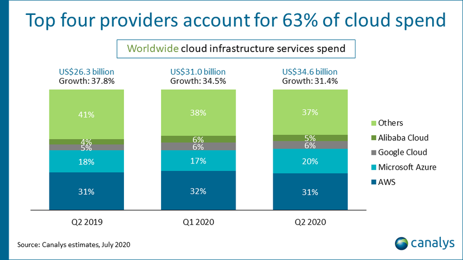

# 클라우드 기술의 현황과 미래

[TOC]

## 클라우드

필요한 작업을 다른 물리 공간에 분산되어 존재하는 데이터 센터에 맡겨 수행하고, 사용자의 컴퓨터는 이 인프라에 접속하여 상호작용하는 단말 역할만 하는 것. (클라우드 컴퓨팅)

또는 해당되는 데이터 센터를 지칭함.

## 클라우드 컴퓨팅의 장점

비용 절감, 탄력성, 접근성

- 비용 : 서버를 구입할 필요가 없고, 이를 유지 보수할 운영 인원이 따로 필요 없어 많은 비용을 절감할 수 있다.	

- 탄력적 : 수요 급증 또는 급감으로 인해 서버 증설이나 축소가 필요할 때에도 자동으로 이를 수행해 불필요한 자원 낭비를 줄인다.

- 접근성 : 어디서든 접속 권한과 단말 역할을 하는 기기만 있다면 클라우드에 접속해 필요한 작업을 수행할 수 있다.

## Iaas, Paas, Saas

클라우드 컴퓨팅의 종류에는 크게 3가지가 있다.

Infrastructure as a Service

Platform as a Service

Software as a Service

I-> P -> S 순으로 클라우드 서비스 업체가 제공하는 서비스의 폭이 넓어진다.

서비스로서의 인프라 : 인프라에 해당하는 네트워킹 기능, 컴퓨터, 가상화, 데이터 공간을 제공함.

서비스로서의 플랫폼 : 개발 환경과 프레임워크까지 제공함. 서버의 규모 변경(scale up, scale out)도 업체에서 맡아서 함. 자원 할당, 최적화 등의 기능들을 다 업체에서 맡음.

기업 입장에서는 개발만 하면 됨.

서비스로서의 소프트웨어 : 사용자가 필요한 서비스 자체를 개발해 제공함.  소프트웨어 개발 자체를 하지 않고, 만들어진 서비스를 활용해 필요한 기능을 만들어내게 된다.

## 3대 클라우드 컴퓨팅 회사들의 장단점

AWS

MS Azure

Google Cloud Platform(GCP)

아래 3개 자료를 참고하였습니다.

lg cns 자료

https://blog.lgcns.com/2204?fbclid=IwAR3cQ-JEsE07-e9z9BHHsRb4l5lTmipwALVWyh9U8TDu1u7LjuWGrDP5yT8

바이라인 자료

https://byline.network/2020/09/10-125/

parkmycloud 자료

https://www.parkmycloud.com/blog/aws-vs-azure-vs-google-cloud-market-share/

## Azure

리전이 국내에 두 군데 있음.(서울, 부산)

윈도우 시스템을 많이 사용해야하는 서비스라면 Azure가 좋다.(EX ) Office 365를 통한 RPA 개발)

비개발자도 사용하기 쉽도록 쉬운 UI로 구성되어 있는 서비스가 많다.

 RPA 도구인 Power Automate를 사용해보았는데 작동 코드를 전면에 내세우지 않고 개발에 대한 기본적인 이해만 있으면 손쉽게 플로우를 짤 수 있었다.

기본적인 학습 가이드라인이 상당히 잘 제시되어 있는 편이다. 

다만 다른 두 서비스에 비해 기본적인 서비스는 가격이 싸지만

추가 가능한 서비스들의 요금은 상대적으로 비싸다.

가장 기본적인 Ddos 방어 서비스만 해도 aws는 무료인데 반해 유료로 제공되고 있다.

------

ㄴMS사의 Saas인 Power Platform중 Power Automate 사용 화면

## AWS

서울에 4개 가용영역을 지닌 리전이 설치되어 있음.

글로벌 클라우드 서비스 시장을 가장 먼저 개척해왔고 시장 점유율 역시 가장 높다.

AWS Certified Solution Architect, Developer 등 자체 서비스에 대한 자격증 운영과 교육 제도 확립을 가장 먼저 시행했다. 국내에 서비스한지도 가장 오래되었고 관련 세미나도 많아 학습 풀이 넓다.

같은 이유로 개인 강의나 사용자들이 작성해놓은 문서들도 많아 학습이 상대적으로 용이하다.

전반적인 성능이 가장 좋다.

2018년 11월 22일에 서울 리전에 장애가 발생하여 해당 리전을 사용중인 서비스들이 84분간 접속 불가 현상을 겪음. 이후 해당 기업들은 리전 사용료의 10퍼센트를 환불받음.

## GCP

서울에 리전이 있음.

오픈소스 기여도가 높음. 예를 들어 쿠버네티스를 만든 회사이기 때문에 쿠버네티스를 클라우드 방식으로 이용한다면 선호할 가능성이 높음 ( 텐서플로우도 마찬가지 ), gcp에서 PaaS나 SaaS 형태의 서비스를 제공받는다면 항상 최신버전의 쿠버네티스가 적용됨.

가성비가 좋은 편.

데이터 센터 규모로는 셋 다 비슷함. 예전에는 국내 리전이 3사 모두 없었지만 최근에는 모두 국내에 리전을 설립하였음.

Data,  AI, IoT 등의 제품 활용 영역은 CSP 3사가 각각의 특장점이 있으며, 전반적으로 아마존이 우위에 있으나 Data, AI 영역에서는 GCP가 앞서 있음.

cockroach labs 2020 클라우드 업체 성능 테스트 결과 요약본

p90 지연시간(The average latency for the slowest 10 percent of requests over the last 10 seconds)

최근 10초 동안 가장 느린 상위 10% 요청의 평균 지연 시간. 
tpmC : 1분간 처리할 수 있는 트랜잭션의 수

https://m.post.naver.com/viewer/postView.nhn?volumeNo=27104055&memberNo=21060

## 쿠버네티스

등장 배경 : 과거에는 물리 서버에서 애플리케이션을 실행했으나, 물리 서버 하나에서 여러 애플리케이션을 실행할 경우 리소스를 평등하게 배분할 방법이 없었다.

이 경우 여러 물리 서버를 동원해 각각 애플리케이션을 실행하도록 했는데 비용 문제로 보나 자원 문제로 보나 매우 비효율적이었다.

때문에 가상화가 도입되었는데, 단일 물리 서버에서 여러 가상 시스템(VM)을 실행해 애플리케이션을 서로 격리하여 자원의 효율성을 높이고, 보안성을 확보할 수 있었다.

또한 물리 서버의 자원이 허락하는 한 얼마든지 애플리케이션을 추가할 수 있었고, 중지와 실행이 자유롭기 때문에 확장성과 탄력성이 대폭 향상되었다.

현재에 이르러서는 가상화를 넘어 컨테이너 개발이 일반화되었다.

컨테이너 개발은 VM과 유사하지만 격리 속성을 완화하여 애플리케이션 간에 운영체제를(OS)를 공유한다.

때문에 가상 서버(vm)를 구동할 필요 없이 작업 중인 운영체제에서 컨테이너를 실행하기만 애플리케이션을 배포할 수 있다.

종속성이 줄어들어 클라우드나 OS 배포본에 모두 이식이 가능하다.

컨테이너 개발이 일반화되면서, 컨테이너들을 관리하는 도구의 필요성도 증가되었다.

컨테이너 개발 및 배포에 있어 컨테이너의 장애를 복구하거나 재배치를 도와주고, 부하가 발생한다면 컨테이너를 추가하여 확장도 시켜주는 컨테이너 오케스트레이션 툴이 그것이다.

그리고 현재 가장 널리 사용되는 컨테이너 오케스트레이션 툴이 바로 쿠버네티스이다.

쿠버네티스는 borg라고 불리는 구글의 내부 플랫폼에서 발전한 툴이다.

구글은 borg를 통해 수 년동안 수십억개의 컨텐츠를 컨테이너 배포하였으며 borg를 개발하는 과정에서 축적된 경험은 쿠버네티스 기술의 주요 원동력이 되었다.

구글, MS, IBM, Red hat 등의 주요 기업들이 쿠버네티스의 개발에 기여하면서 컨테이너 오케스트레이션 툴의 표준으로 자리잡았다.

## 클라우드 개발에서 쿠버네티스의 역할

무중단 배포에 도움

다양한 클라우드 어플리케이션과 호환

로드밸런싱역할(서버, 컨테이너간)

https://bcho.tistory.com/1256?category=731548

## 클라우드 사업의 전망

- 아직 개척되지 않은 시장에 대한 가능성

https://reoim.tistory.com/entry/%ED%81%B4%EC%95%8C%EB%AA%BB%EC%97%90%EC%84%9C-AWS-%EC%9D%B4%EC%A7%81%EA%B9%8C%EC%A7%80

클라우드에 전혀 일가견이 없던 한 개발자가 6개월간 GCP 학습을 통해 업계의 리딩 개발자가 된 사례이다.

본문의 개발자가 공부를 시작할 당시에 시장의 대세는 AWS였고, 국내에 GCP는 리전도 없었으며 관련 문서들이나 시험에 대한 정보도 전무한 상황이었다.

필자는 구글 클라우드 스터디잼 프로그램을 통해 클라우드 입문, 중급, 심화반 과정을 수료하고 머신러닝 과정도 심화반까지 수료를 하였다.

이를 통해 얻은 지식으로 오픈소스 토이 프로젝트를 공유했고 GCP 시장에 이름을 알리기 시작했다.

8번의 크고 작은 컨퍼런스, 밋업 발표를 진행했고 GCP와 AWS를 포함한 9건의 이직 제안을 받았다고 한다.

개인의 성공 사례가 기업의 성공 사례에 완전히 대응되지는 않겠지만, 클라우드 사업을 막 시작하는 업체의 입장에서는 어느 정도 참고할 만한 사례라고 생각되었다.

- SaaS 시장의 성장세

https://kinsta.com/blog/cloud-market-share/
